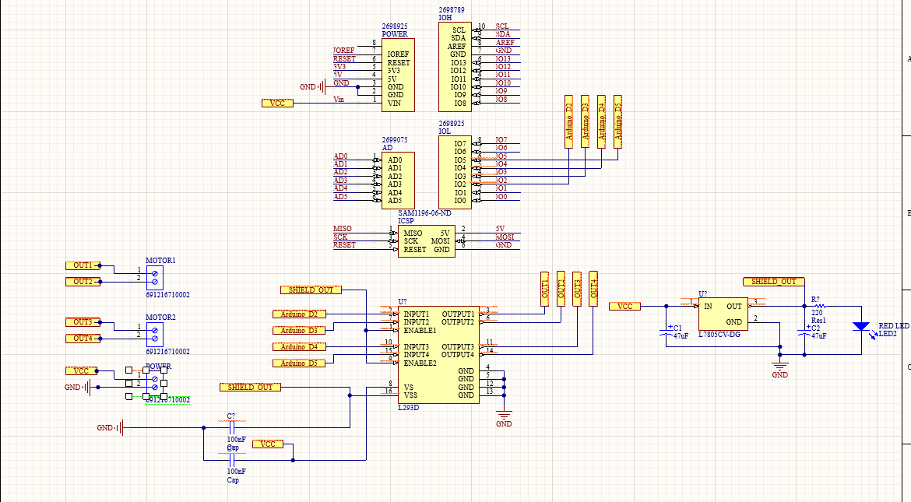
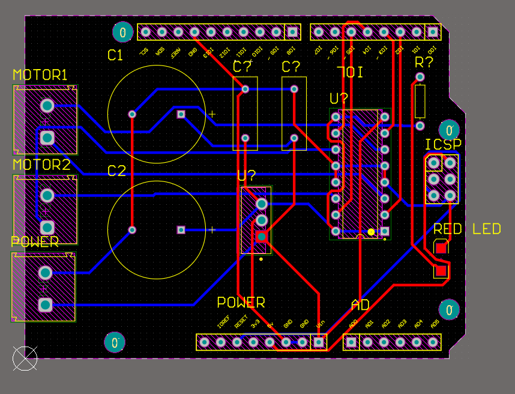
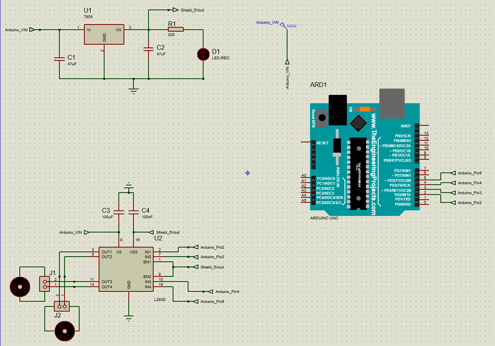

# Custom Arduino Motor Shield PCB (L293D)

A custom-designed **Arduino Uno compatible motor shield PCB** based on the **L293D dual H-Bridge motor driver**, built to control **two DC motors** (or one stepper motor) directly from an Arduino.  
The schematic was **simulated and verified in Proteus** before PCB implementation.

---

## ✅ Features

- **Arduino Uno compatible shield (Uno R3 footprint)**
  - Matches standard Uno headers: **POWER**, **ANALOG**, **DIGITAL I/O**, and **ICSP**
- Motor driving using **L293D dual H-Bridge**
- Supports:
  - **2 × DC motors**
- Motor screw terminal outputs:
  - `OUT1`, `OUT2` → Motor 1
  - `OUT3`, `OUT4` → Motor 2
- Onboard **5V regulator (L7805CV)** for stable logic supply
- **Power LED indicator**
- Decoupling capacitors to improve stability and reduce noise

---

## 📌 Compatibility

✅ Compatible with:
- Arduino Uno R3
- Arduino Uno-compatible boards with the same shield header layout

---

## ⚡ Power System

### External Motor Supply Input
The shield uses an external power input labeled:
- `VCC`
- `GND`

### Onboard Regulation
Includes a **L7805CV** linear regulator to generate **5V** logic supply.

Key components:
- `C1 = 47µF` input smoothing capacitor
- `C2 = 47µF` output smoothing capacitor
- `R = 220Ω` + `RED LED` as power indicator

> ⚠️ Note: The 7805 is a linear regulator, so high input voltage may generate heat. Add a heatsink if required.

---

## 🔌 Motor Connections

### Output Terminals
- **Motor 1**: connect to `OUT1` and `OUT2`
- **Motor 2**: connect to `OUT3` and `OUT4`

---

## 🧠 Arduino Pin Mapping (Control Pins)

L293D control inputs are mapped to Arduino Uno digital pins:

| Arduino Pin | L293D Signal |
|-------------|--------------|
| D2          | INPUT1       |
| D3          | INPUT2       |
| D4          | INPUT3       |
| D5          | INPUT4       |

> `ENABLE1` and `ENABLE2` are intended to be driven by PWM pins (recommended) for motor speed control, but for now are connected to VCC through the regulator.

---

## 🧩 L293D Overview

The **L293D** is a dual H-Bridge driver that provides:
- Bidirectional motor control
- Dual motor support
- Built-in flyback diode protection (important for inductive loads)

---

## 🧪 Proteus Simulation (Verification)

The complete design was **simulated in Proteus** prior to PCB production to verify:
- Correct L293D input/output behavior
- Forward/reverse motor direction control
- Arduino pin mapping and signal logic
  
# 📁 Project Files

- **[`Arduino Code/`](Arduino%20Code/)**  
  Arduino sketches (`.ino`) used to test and operate the motor shield (direction control).

- **[`Motor Shield PCB/`](Motor%20Shield%20PCB/)**  
  PCB design/manufacturing outputs such as Gerbers, layout exports, and PCB renders/previews.

- **[`Proteus/`](Proteus/)**  
  Proteus simulation project files used to validate the schematic and motor control logic before fabrication.

- **[`Video/`](Video/)**  
  Demonstration video showing the shield working on real hardware.

## 📄 License

This project is licensed under the MIT License — see the [LICENSE](LICENSE) file for details.